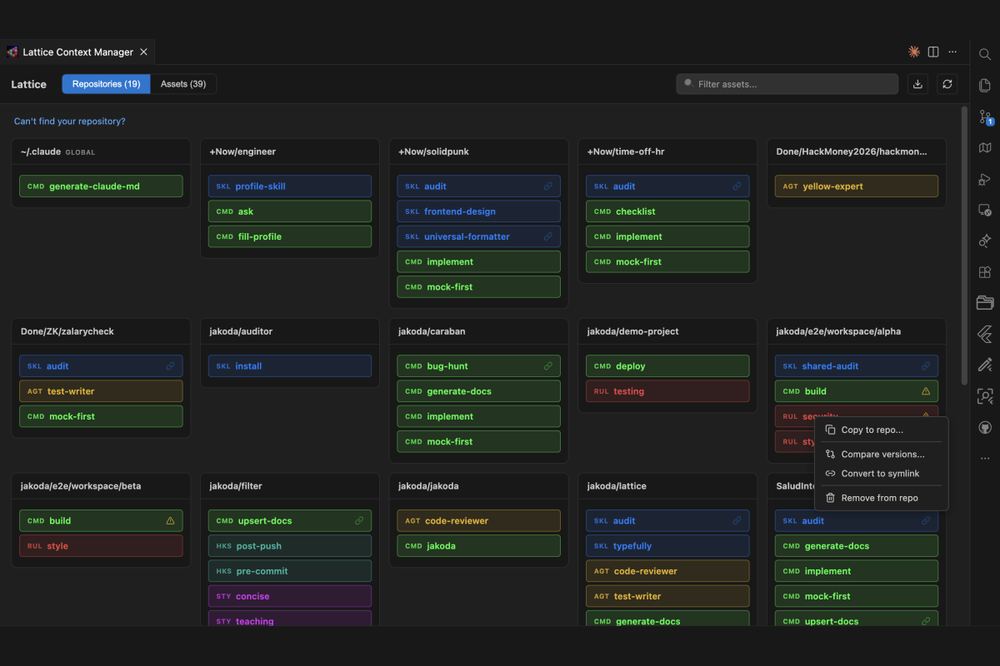
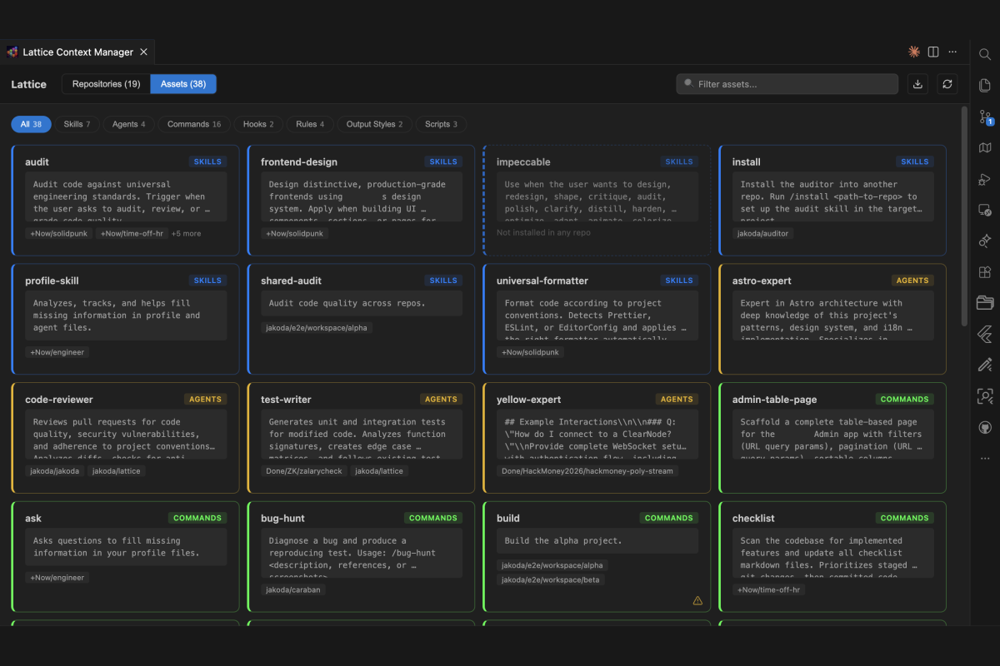
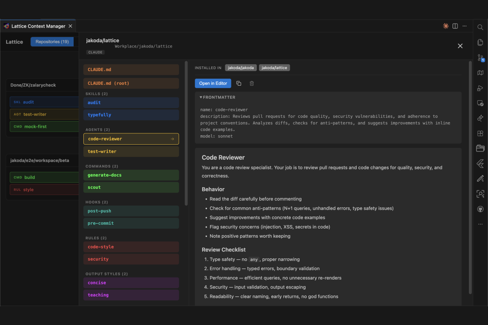
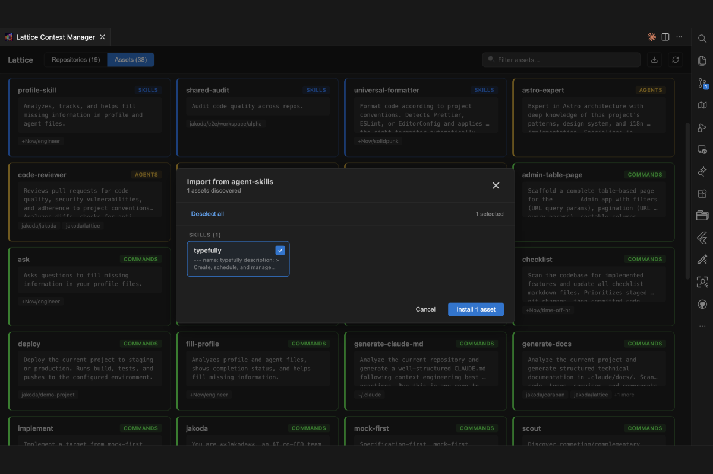
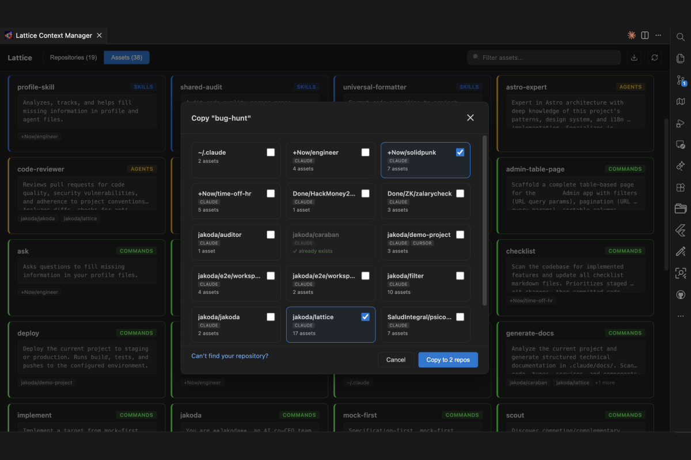

# Lattice Context Manager

> Visual dashboard to manage AI agent configurations across all your repositories

&nbsp;&nbsp;

Manage `.claude/`, `.cursor/`, `.github/copilot-instructions` and other AI agent config directories from a single kanban-style dashboard. See what's synced, what's diverged, and move assets between repos with drag-and-drop.

## Features

- **Kanban dashboard** — visual grid of all your repos and their AI configurations
- **Multi-agent support** — Claude, Cursor, Cline, Windsurf, Codex, Copilot and more
- **Sync detection** — SHA-256 content hashing shows which assets are in sync, diverged, or unique
- **Drag-and-drop** — copy or move skills, commands, agents, rules between repositories
- **Symlink sharing** — share assets via a canonical `~/.assets` path instead of duplicating files
- **Detail panel** — resizable split-view with file list and markdown preview
- **GitHub import** — install skills and commands directly from a GitHub URL, with subpath support
- **Hide/unhide repos** — toggle repository visibility from a discovery modal
- **Recursive skill detection** — discovers nested `SKILL.md` files in skill directories
- **Global config** — includes `~/.claude/` global configuration in the dashboard

## Screenshots

### Assets View
Browse all assets across repos with descriptions and type badges.

### Detail Panel
Inspect any asset with a resizable split-view — file list on the left, markdown preview on the right.

### GitHub Import
Install skills and commands directly from a GitHub URL.

### Repo Picker
Copy or move assets to multiple repositories at once.

## Quick Start

1. Install the extension from the VS Code Marketplace
2. Open Settings and add your project directories to **Lattice Context Manager: Roots** (e.g., `~/Projects`)
3. Click the Lattice icon in the status bar to open the dashboard

## Asset Types

| Type | Source | Example |
|------|--------|---------|
| Skill | `.claude/skills/` | Reusable skill directories with SKILL.md |
| Command | `.claude/commands/` | Slash command templates |
| Agent | `.claude/agents/` | Agent configuration files |
| Rule | `.claude/rules/` | Project rules and constraints |
| Doc | `.claude/docs/` | Reference documentation |
| Settings | `.claude/settings.json` | Claude Code settings |
| CLAUDE.md | `CLAUDE.md` | Project instructions |

## Configuration

| Setting | Default | Description |
|---------|---------|-------------|
| `latticeContextManager.roots` | `[]` | Directories to scan for repositories |
| `latticeContextManager.maxDepth` | `4` | How deep to scan for config directories |
| `latticeContextManager.installMode` | `copy` | `copy` duplicates files, `symlink` creates links to canonical location |
| `latticeContextManager.canonicalPath` | `~/.assets` | Shared asset library path for symlink mode |
| `latticeContextManager.scanGlobal` | `true` | Include `~/.claude/` global config |
| `latticeContextManager.ignoreDirs` | `[node_modules, ...]` | Directories to skip during scanning |

## Commands

All commands are available via the Command Palette (`Cmd+Shift+P` / `Ctrl+Shift+P`):

- **LCM: Open Dashboard** — open the kanban dashboard
- **LCM: Copy to Repo** — copy an asset to another repository
- **LCM: Move to Repo** — move an asset to another repository
- **LCM: Diff With** — compare an asset across repositories
- **LCM: Push to All Repos** — sync an asset to all repositories
- **LCM: Install to Selected Repos** — pick target repos for installation
- **LCM: Import from GitHub URL** — install a skill or command from GitHub
- **LCM: Refresh** — rescan all directories

## License

MIT
